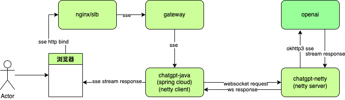
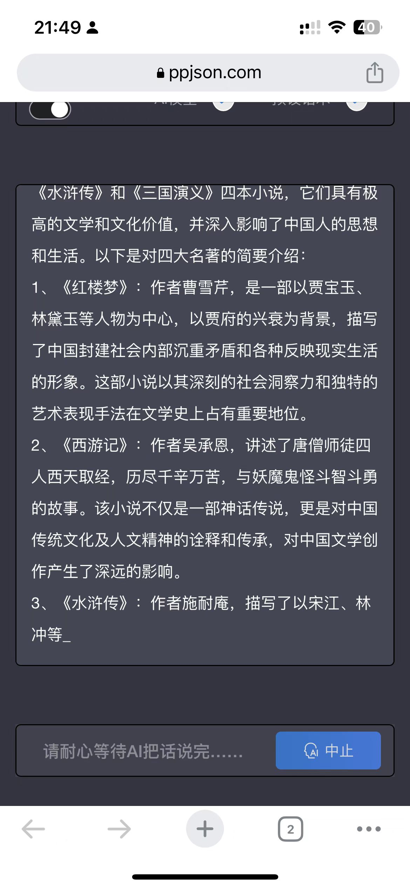
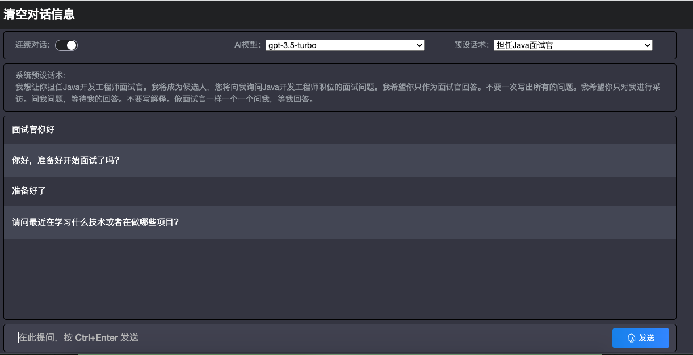

# chatgpt-java
## 架构图

1. 本项目采用java springcloud搭建。
2. 用户访问浏览器经过nginx转发到网关后，网关转发到后端具体的服务，该服务调用netty-server，netty-server把具体的请求提交给openai
## 项目搭建遇到的问题
1. 由于项目网关层采用zuul1.x的网关，该版本不支持sse技术，后由nginx直接转发sse的请求到后端具体服务(chatgpt-java)
2. 目前只找到okhttp3 sse的支持，但okhttp3每个版本的差异化太大，匹配和查找版本耽误了1天的时间
3. 国内访问不到https://api.openai.com接口服务，但有很多其他国外的代理域名可以使用。不需要翻，这里仅仅提供一个思路。
4. chatgpt由于每个问题都需要进行思考，有一段等待的时间，如果等他数据全部返回，返回的内容如果过多，用户需要等待较长的时间。所以整个项目上采用Event-Stream推流的方案实现，节省用户的等待时间，把响应的结果实时推送给用户。

## 效果图

## 网址
https://www.ppjson.com

微信号：**ahliujing**

## 鸣谢
前端页面采用[dirk1983](https://github.com/dirk1983/chatgpt) 的代码